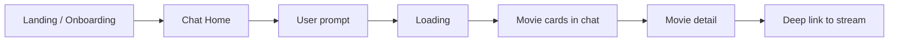

# UX Flows

Key user journeys screen by screen. Hypothesized for v1 MVP — update after prototype testing.

## Flow 1: First visit → first pick

| Step | Entry | Exit | Edge cases |
|------|-------|------|------------|
| Onboarding | App open, no profile | Chat home | Skip → cold-start prompts only |
| Prompt | Chat input or chip | Send | Empty send disabled |
| Results | AI response | Tap card | Zero results → refine prompt suggestions |
| Detail | Card tap | Back to chat | Metadata missing → show partial card |
| Watch | "Where to watch" | External app | Unavailable in region → show rent/buy or alternatives |

## Flow 2: Return user → watchlist

**Entry:** App open, profile exists → Chat home with optional watchlist badge.

**Path:** Home → ask for something new *or* Watchlist → pick saved title → detail → stream.

**Edge cases:** Empty watchlist → illustration + "Ask for recommendations"

## Flow 3: Save for later

**Entry:** Movie detail or card overflow menu.

**Path:** Save → toast confirmation → item in watchlist.

**Edge cases:** Duplicate save → toggle unsave; offline → queue save or show error.

## Flow 4: Error recovery

**Entry:** Network or AI failure mid-request.

**Path:** Error inline in chat → Retry → success or escalate to simplified browse (future).

## Out of scope (v1)

- Multi-user watch party sync
- In-app video playback
- Public profile / followers

## Related docs

- [Design requirements](./design-requirements.md)
- [Users & personas](../knowledge/users-and-personas.md)
- [PRD](../prd/prd.md)
